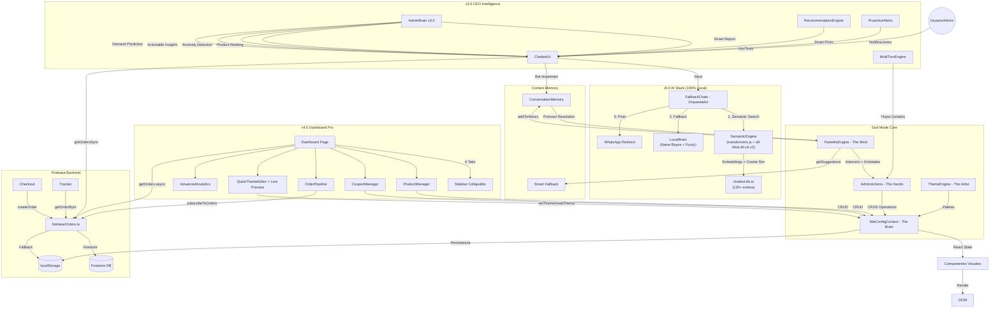

# 🏗️ Arquitectura del Sistema: Antojín AI (God Mode v5.0)

Este documento detalla la arquitectura técnica de **Antojitos Express**, una e-commerce SPA (Single Page Application) controlada por una IA autónoma local.

**Autor y Arquitecto:** Rodrigo Alejandro Vega Rojas (DarckRovert).

---

## 1. Visión General

El sistema utiliza un **"Cerebro Frontend"** (`SiteConfigContext`) que persiste en `localStorage` / Gun.js P2P y es manipulado por un stack de IA local que incluye un motor de embeddings semánticos, un clasificador Naive Bayes, y un motor NLP simbólico. Desde la **Fase 20**, los pedidos se persisten en **Firebase/Firestore** (con fallback automático a localStorage).

> ⚠️ **Zero dependencias de IA externa.** Toda la inteligencia artificial corre en el navegador del usuario usando `transformers.js`.

### Diagrama de Flujo de Datos



---

## 2. Los Pilares del Sistema

### 🧠 1. El Cerebro: `SiteConfigContext.tsx`
Es la fuente de la verdad (Single Source of Truth).
- **Responsabilidad:** Almacenar el estado global de la tienda (productos, textos, colores, cupones).
- **Persistencia:** Guarda automáticamente en `localStorage` bajo la clave `dm_config` + sincronización P2P via Gun.js.
- **Hooks Expuestos:** `useProducts()`, `useContent()`, `useTheme()`, etc.

### 🗣️ 2. La Mente: `pastelitoEngine.ts`
El motor de entendimiento simbólico. Token-free, sistema experto de coincidencia de patrones y extracción de entidades.
- **Intenciones Soportadas:** 60+ (ej: `cambiar_precio`, `modo_estacional`, `optimizar_todo`).
- **Entidades:** Detecta precios (`S/50`), colores (`rojo`), porcentajes (`20%`), y productos por nombre difuso ("fuzzy matching").
- **Memoria de Contexto:** Recuerda `lastProduct`, `lastCategory`, `lastAction` y los últimos 10 mensajes (user + bot).
- **Resolución de Pronombres:** "ponle precio de 20" → si el último producto fue "Chocoteja", aplica a ese.
- **Smart Fallback:** `getSuggestions()` devuelve hasta 3 intents similares cuando no reconoce el input.

### 🛠️ 3. Las Manos: `adminActions.ts`
El ejecutor. Traduce las intenciones de la mente en cambios de estado en el cerebro.
- **Mapeo:** `Execute(intent, entities) -> Context.Update()`.
- **Lógica de Negocio:** Aquí reside la inteligencia financiera (`adminBrain`) y las reglas de validación (ej: no bajar precio a menos de 0).
- **Autopilot:** Funciones como `optimizeShop()` que analizan el estado y reparan problemas automáticamente.

### 🎨 4. El Artista: `themeEngine.ts`
El motor de diseño.
- **Presets:** 10 configuraciones visuales pre-diseñadas (Navidad, Lujo, Verano, etc.).
- **Algoritmo:** Mapea nombres de colores en lenguaje natural ("vino tinto", "azul cielo") a códigos Hexadecimales.

### 🆕 5. Stack de IA Autónomo (v5.0)

> Toda la inteligencia corre en el navegador. Cero APIs externas.

#### Cadena de Respuesta (FallbackChain)
```
1. Semantic Engine (transformers.js) → confianza > 0.55 → respuesta directa
2. Local Brain (Naive Bayes)        → score > -20       → respuesta por intent
3. WhatsApp Redirect                → fallback final
```

| Módulo | Archivo | Función |
|---|---|---|
| **SemanticEngine** 🆕 | `lib/ai/semanticEngine.ts` | Modelo `all-MiniLM-L6-v2` (~23MB, cached). Embeddings + cosine similarity sobre 120+ entradas de KB. Entiende significado semántico, no solo keywords. |
| **LocalBrain** | `lib/ai/localBrain.ts` | Clasificador Naive Bayes entrenado con Golden Dataset + búsqueda fuzzy de productos y FAQs. |
| **FallbackChain** | `lib/ai/fallbackChain.ts` | Orquesta la cadena: Semantic → LocalBrain → WhatsApp. Simula streaming para UX premium. |
| **VisionBrain** | `lib/ai/visionBrain.ts` | MobileNet (TensorFlow.js) para clasificación de imágenes de tortas (Proof of Cake). |
| **PastelitoEngine** | `lib/pastelitoEngine.ts` | NLP simbólico: 60+ intents, extracción de entidades, memoria de contexto. |
| **RecommendationEngine** | `lib/recommendationEngine.ts` | Recomienda productos según popularidad, hora del día y stock. |
| **ProactiveAlerts** | `lib/proactiveAlerts.ts` | Alertas automáticas: stock, ventas, fechas peruanas. |
| **MultiTurnEngine** | `lib/multiTurnEngine.ts` | State machine para Wizards de creación guiada. |

### 🆕 6. CEO Brain v3.0 (Smart Analytics)

| Función | Descripción |
|---|---|
| `getSmartReport()` | Reporte ejecutivo completo que combina ventas, utilidad, ranking, anomalías y sugerencias en un solo informe. |
| `getProductRanking()` | Ranking de productos por revenue y unidades vendidas. |
| `getAnomalies()` | Detecta: cero pedidos en horario laboral, caída >30% vs semana pasada, dominio de producto >60%. |
| `getActionableInsights()` | Sugerencias inteligentes: combos frecuentes, stock agotado, diversificación de pagos, ticket promedio bajo. |
| `predictDemand()` | Predicción de demanda basada en el patrón histórico por día de la semana. |
| `exportToCSV()` | Exporta historial de pedidos como archivo CSV. |

### 7. Dashboard Pro (v4.0)

| Componente | Archivo | Función |
|---|---|---|
| **ProductManager** | `dashboard/ProductManager.tsx` | Grid visual, edición inline de precios, toggles stock/featured, búsqueda + filtro, formulario "Agregar Producto" |
| **OrderPipeline** | `dashboard/OrderPipeline.tsx` | Pipeline visual de pedidos por estado, cambio de estado con clic, indicador de fuente de datos (🔥 Firebase / 💾 Local), notificación WhatsApp, expansión de detalles |
| **CouponManager** | `dashboard/CouponManager.tsx` | Crear/eliminar cupones, toggle activo/inactivo con switch visual |
| **QuickThemeEditor** | `dashboard/QuickThemeEditor.tsx` | 4 color pickers, dark mode, galería de presets, restaurar, **preview en vivo** |
| **AdvancedAnalytics** | `dashboard/AdvancedAnalytics.tsx` | Barras comparación semanal, hora pico, mejor día, Top 5 productos |
| **Dashboard Page** | `admin/dashboard/page.tsx` | Layout con sidebar collapsible + 6 tabs (Resumen, Productos, Pedidos, Cupones, Tema, Analytics) |

### 8. Firebase Backend

| Módulo | Archivo | Función |
|---|---|---|
| **Firebase Init** | `lib/firebase.ts` | Configuración, env vars, `isFirebaseConfigured()` fallback detection |
| **Orders CRUD** | `lib/firebaseOrders.ts` | `createOrder`, `getOrders`, `getOrderById`, `updateOrderStatus`, `subscribeToOrders`, `getOrdersSync` |
| **Order Confirm** | `checkout/confirm/page.tsx` | Confirmación visual con pipeline de estado post-checkout |
| **Tracker** | `tracker/page.tsx` | Rastreo en vivo con estado real de Firestore, auto-refresh, URL params |

**Status Pipeline:** `nuevo` → `confirmado` → `preparando` → `enviado` → `entregado` (+ `cancelado`)

---

## 3. Estructura de Datos (Persistencia)

### localStorage

| Clave | Descripción | Estructura |
|---|---|---|
| `dm_config` | Configuración total del sitio (JSON) | `{ products: [], theme: {}, content: {} }` |
| `dm_orders` | Base de datos de pedidos (fallback) | `[{ id, total, customer, status, createdAt, updatedAt }]` |
| `dm_feedbacks` | Comentarios de clientes | `[{ rating, comment, product }]` |
| `dm_admin_auth` | Token de sesión admin | `'true' | null` |
| `dm_admin_auth_time` | Timestamp de login admin | Unix timestamp (string) |
| `dm_chat_history` | Historial de conversación (v2.0) | `[{ id, text, sender, isAdmin, timestamp }]` |

### Firestore (cuando Firebase está configurado)

| Colección | Campos | Índices |
|---|---|---|
| `orders` | `id`, `customer`, `phone`, `items[]`, `total`, `status`, `createdAt`, `updatedAt`, `paymentMethod`, `paymentConfirmed`, `deliveryZone`, `isGift`, `giftMessage` | `createdAt desc`, `status + createdAt` |

### Browser Cache (transformers.js)

El modelo `all-MiniLM-L6-v2` (~23MB) se descarga la primera vez que el usuario abre el chat y se cachea automáticamente en el almacenamiento del navegador (Cache API). Las siguientes cargas son instantáneas.

---

## 4. Calidad de Código

| Métrica | Estado |
|---|---|
| `console.log` en producción | **0** ✅ |
| Tipos `any` | **2** (solo en `semanticEngine.ts` para tipos de `transformers.js`) |
| `@ts-ignore` | **0** ✅ (reemplazados por `modules.d.ts`) |
| TypeScript strictness | `npx tsc --noEmit` = 0 errores |
| Dependencias IA externas | **0** ✅ (ni Gemini, ni OpenAI, ni APIs de terceros) |

### Type Declarations (`src/types/modules.d.ts`)
Declaraciones de tipos para módulos sin TypeScript nativo:
- `@web3modal/ethers/react`
- `@tensorflow/tfjs`
- `@tensorflow-models/mobilenet`

---

## 5. Tecnologías Clave

- **Frontend:** Next.js 16.1.6 (App Router)
- **Lenguaje:** TypeScript 5 (strict)
- **Estilos:** TailwindCSS v4
- **Backend:** Firebase/Firestore (fallback localStorage)
- **P2P:** Gun.js (null-safe, typed)
- **AI (Local):** SemanticEngine (`transformers.js`) + PastelitoEngine (NLP) + LocalBrain (Naive Bayes) + MobileNet (Vision)
- **Web3:** Ethers.js + Web3Modal (Polygon Amoy)
- **Build Tool:** Turbopack

---
Documentación generada automáticamente por DarckRovert.


## 🚀 Optimización de Rendimiento
Se ha implementado un Web Worker (`nlp.worker.ts`) para procesar el NLP (Natural Language Processing) en paralelo, manteniendo la interfaz de usuario a 60 FPS sin bloqueos en el hilo principal.