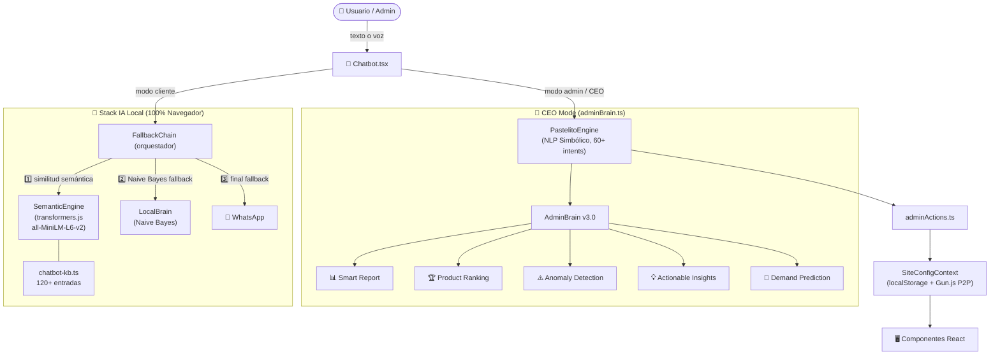
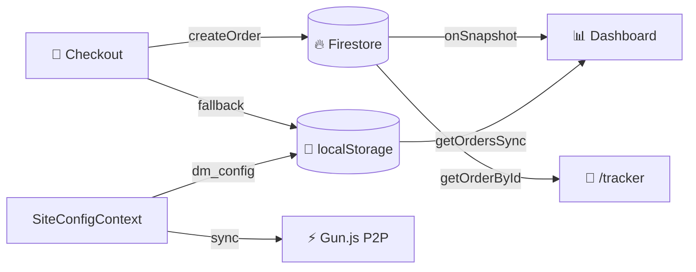
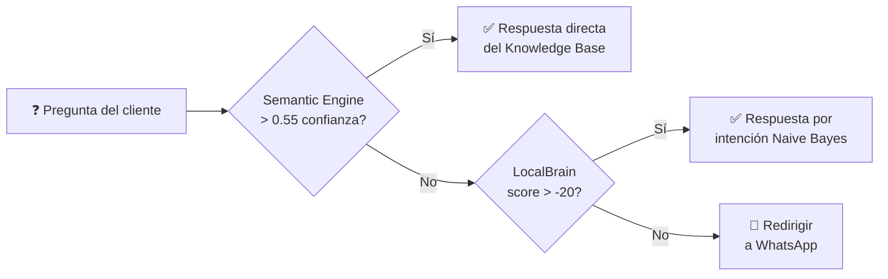

# 🗺️ Diagrama de Arquitectura — Pastelito AI v5.0

## Flujo Principal



---

## Capa de Datos



---

## Estructura de Archivos Clave

```
src/
├── app/
│   ├── admin/dashboard/    → Dashboard Pro (6 tabs)
│   ├── checkout/           → Checkout + Confirm
│   └── tracker/            → Rastreo en vivo
├── components/
│   ├── Chatbot.tsx          → UI del chatbot
│   └── dashboard/          → ProductManager, OrderPipeline, etc.
├── data/
│   ├── products.ts          → Catálogo de productos
│   └── chatbot-kb.ts       → Knowledge Base (120+ entradas)
├── hooks/
│   └── useChatActions.ts   → Acciones del chatbot (CEO + cliente)
└── lib/
    ├── ai/
    │   ├── semanticEngine.ts  → 🆕 IA semántica (transformers.js)
    │   ├── localBrain.ts      → Naive Bayes classifier
    │   ├── fallbackChain.ts   → Orquestador de respuestas
    │   └── visionBrain.ts     → MobileNet (Proof of Cake)
    ├── adminBrain.ts          → CEO analytics v3.0
    ├── pastelitoEngine.ts     → NLP simbólico
    ├── firebase.ts            → Firebase init
    └── firebaseOrders.ts      → CRUD pedidos Firestore
```

---

## Cadena de Respuesta del Chatbot


